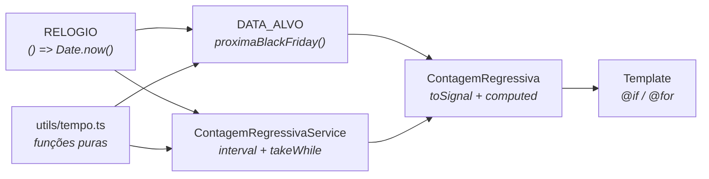
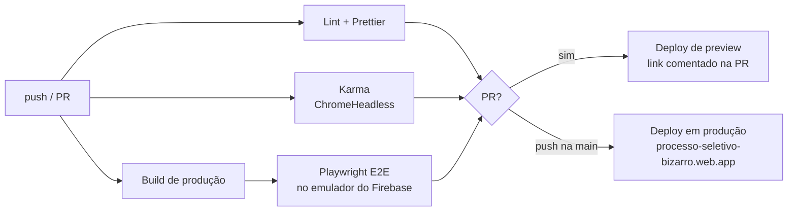

<div align="center">

# ⏱️ Black Friday · Contagem Regressiva

**Banner de campanha com contagem regressiva em tempo real para a próxima Black Friday.**
Desafio técnico do processo seletivo da **MM12** (2021), modernizado em 2026 com Angular 22,
testes automatizados, CI/CD e hardening de segurança.

[](https://github.com/Bizzye/processo-seletivo/actions/workflows/ci-cd.yml)


[](LICENSE)

### 🔗 [processo-seletivo-bizarro.web.app](https://processo-seletivo-bizarro.web.app)


</div>

---

## 📋 Sumário

- [O desafio](#-o-desafio)
- [Screenshots](#-screenshots)
- [Antes × depois](#-antes--depois)
- [Funcionalidades](#-funcionalidades)
- [Stack](#-stack)
- [Arquitetura](#-arquitetura)
- [Qualidade e testes](#-qualidade-e-testes)
- [CI/CD](#-cicd)
- [Segurança](#-segurança)
- [Como rodar](#-como-rodar)

## 🎯 O desafio

A partir de uma arte de campanha (imagem estática com a faixa amarela "FALTAM"), implementar uma
contagem regressiva em **dias, horas, minutos e segundos** posicionada exatamente sobre a faixa,
funcionando em **qualquer tamanho de tela**.

## 📸 Screenshots

<table>
  <tr>
    <th>Desktop (1440px)</th>
    <th>Tablet (820px)</th>
    <th>Mobile (390px)</th>
  </tr>
  <tr>
    <td></td>
    <td></td>
    <td></td>
  </tr>
</table>

Quando a Black Friday termina com a página aberta, a contagem para e exibe **"Encerrada"**:


> As imagens são geradas automaticamente com Playwright (`npm run screenshots`), com o relógio do
> navegador congelado para que fiquem reproduzíveis.

## 🔄 Antes × depois

| 2021 (versão original, em produção até a v2.0)                              | 2026 (v2.0)                                                             |
| --------------------------------------------------------------------------- | ----------------------------------------------------------------------- |
|  |  |
| Data fixa em 26/11/2021: números sumiram após expirar                       | Data calculada: sempre conta para a **próxima** Black Friday            |
| Rótulos desalinhados (`flex-direction: coluna`)                             | Layout com _container queries_, alinhado em qualquer largura            |
| Angular 10 · 205 vulnerabilidades no `npm audit`                            | Angular 22 · 0 vulnerabilidades no `npm audit`                          |
| Sem testes funcionais, sem CI                                               | 29 testes unitários (100%) + 12 E2E · CI/CD com deploy automático       |

## ✨ Funcionalidades

- **Data-alvo automática:** calcula a Black Friday (sexta após a 4ª quinta-feira de novembro) e, depois que ela termina, passa a contar para a do ano seguinte.
- **Atualização a cada segundo** com RxJS + signals, liberando o timer ao destruir o componente.
- **Estado "Encerrada"** quando o prazo é atingido com a página aberta.
- **Responsivo sem media queries:** tipografia em unidades `cqi`, escala junto com a arte.
- **Acessível:** `role="timer"` com descrição por extenso ("Faltam 26 dias, 11 horas…"), `alt` descritivo e `h1` para leitores de tela.
- **Leve:** ~37 kB (gzip) de JavaScript inicial, fontes locais e arte em AVIF (39 kB, −56% vs. JPEG) com preload e prioridade de carregamento.

## 🧰 Stack

| Camada      | Tecnologias                                                                                  |
| ----------- | -------------------------------------------------------------------------------------------- |
| Framework   | Angular 22 (standalone, **zoneless**, signals, control flow `@if`/`@for`)                    |
| Linguagem   | TypeScript 6 em modo `strict` + `strictTemplates`                                            |
| Reatividade | RxJS 7 + `toSignal` / `computed`                                                             |
| Estilo      | SCSS, container queries, `@fontsource/roboto`                                                |
| Testes      | Karma + Jasmine (unitários) · Playwright (E2E e screenshots)                                 |
| Qualidade   | ESLint (`angular-eslint`, `typescript-eslint`) · Prettier · Husky · lint-staged · commitlint |
| CI/CD       | GitHub Actions · Firebase Hosting (preview por PR + produção) · Dependabot                   |

## 🏗️ Arquitetura

```
src/app/
├── core/
│   ├── models/tempo-restante.ts            # contrato tipado do tempo restante
│   ├── utils/tempo.ts                      # funções puras: cálculo e regra da Black Friday
│   ├── tokens/tempo.tokens.ts              # RELOGIO e DATA_ALVO (InjectionTokens)
│   └── services/contagem-regressiva.service.ts  # fluxo reativo (Observable)
├── features/contagem-regressiva/           # componente de apresentação (OnPush + signals)
├── app.ts                                  # shell da aplicação
└── app.config.ts                           # providers globais
```



**Decisões de design**

- **Funções puras** concentram a regra de negócio: fáceis de testar e sem dependência do Angular.
- **Injeção de dependência como Strategy:** o "agora" (`RELOGIO`) e a data-alvo (`DATA_ALVO`) são tokens. Em produção usam `Date.now()` e a próxima Black Friday; nos testes, valores fixos. Trocar a campanha é só fornecer outro `DATA_ALVO`.
- **Service reativo** emite de forma síncrona na inscrição (`startWith`), o que permite `toSignal(..., { requireSync: true })`, e completa sozinho ao expirar.
- **Componente burro:** só formata (`computed`) e renderiza; `ChangeDetectionStrategy.OnPush` em todos os componentes.

## ✅ Qualidade e testes

| Tipo       | Ferramenta      | Cobertura                                                                                                                 |
| ---------- | --------------- | ------------------------------------------------------------------------------------------------------------------------- |
| Unitários  | Karma + Jasmine | **29 testes · 100%** de statements, branches, functions e lines (mínimo de 90% no CI)                                     |
| E2E        | Playwright      | **12 testes** (desktop + Pixel 7): valores, tique a cada segundo, encerramento, virada de ano, layout e console sem erros |
| Lint       | ESLint          | regras `strict` + acessibilidade de templates + `prefer-signals` + `OnPush` obrigatório                                   |
| Formatação | Prettier        | verificado no CI e no pre-commit                                                                                          |
| Commits    | commitlint      | Conventional Commits obrigatório (hook `commit-msg`)                                                                      |

O tempo é controlado nos testes: `jasmine.clock()` + token `RELOGIO` nos unitários e
`page.clock` do Playwright no E2E. Nenhum teste depende da data real.

## 🚀 CI/CD



- O E2E roda contra o **mesmo artefato** que vai para produção, servido pelo emulador do Firebase Hosting com os headers reais (CSP inclusa).
- Cada PR ganha uma URL de preview (expira em 7 dias).
- Dependabot abre PRs semanais agrupadas (Angular, testes, lint) e mensais para as Actions.

> **Configuração necessária:** criar o secret `FIREBASE_SERVICE_ACCOUNT` no repositório com o JSON
> de uma service account com papel _Firebase Hosting Admin_ (ou rodar `firebase init hosting:github`).

## 🔒 Segurança

- **Content-Security-Policy** restritiva (`default-src 'self'`, sem scripts inline, `frame-ancestors 'none'`).
- **HSTS**, `X-Content-Type-Options`, `X-Frame-Options`, `Referrer-Policy`, `Permissions-Policy`, COOP/CORP.
- **Subresource Integrity** (SRI) nos bundles JS/CSS.
- **Sem requisições a terceiros:** fontes servidas pelo próprio domínio.
- **0 vulnerabilidades** no `npm audit` (produção e desenvolvimento).
- Workflow do GitHub Actions com `permissions` mínimas por job; deploy de preview bloqueado para PRs de forks.

## 💻 Como rodar

**Pré-requisitos:** Node.js 24 (veja `.nvmrc`) e npm.

```bash
git clone https://github.com/Bizzye/processo-seletivo.git
cd processo-seletivo
npm install
npm start               # http://localhost:4200
```

| Script                | Descrição                                                    |
| --------------------- | ------------------------------------------------------------ |
| `npm start`           | servidor de desenvolvimento                                  |
| `npm run build`       | build de produção em `dist/processo-seletivo/browser`        |
| `npm test`            | testes unitários em modo watch                               |
| `npm run test:ci`     | testes unitários headless com cobertura                      |
| `npm run e2e`         | build + testes E2E (Playwright, desktop e mobile)            |
| `npm run screenshots` | build + regera as imagens de `docs/screenshots`              |
| `npm run serve:dist`  | serve o build pelo emulador do Firebase Hosting (porta 4317) |
| `npm run lint`        | ESLint                                                       |
| `npm run format`      | Prettier                                                     |

> Na primeira execução do E2E, instale o navegador: `npx playwright install chromium`.

<div align="center">

Feito por **Daniel Bizarro** · [GitHub](https://github.com/Bizzye)

</div>
